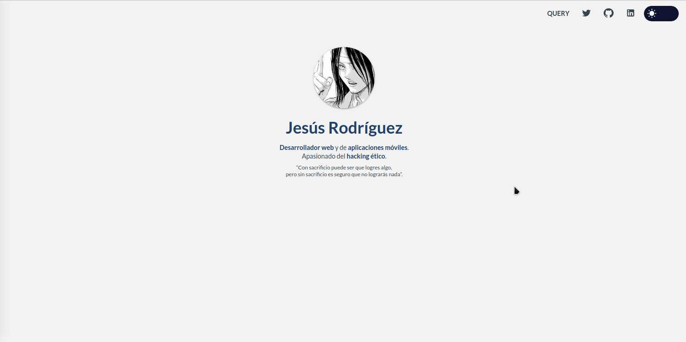

[![Contributors][contributors-shield]][contributors-url]
[![Forks][forks-shield]][forks-url]
[![Stargazers][stars-shield]][stars-url]
[![LinkedIn][linkedin-shield]][linkedin-url]

<br />
<p align="center">
  <a>
    
  </a>

  <h3 align="center">Portfolio</h3>

  <p align="center">
    Personal project where i'm gonna be using Golang as a REST API, MongoDB, Mongo-express, ReactJS and DockerCompose to show my projects. 
    <br />
    <br />
    <a href="https://github.com/sudo-von/portfolio"><strong>Explore the docs »</strong></a>
    <br />
    ·
    <a href="https://github.com/sudo-von/portfolio/issues">Report Bug</a>
    ·
    <a href="https://github.com/sudo-von/portfolio/issues">Request Feature</a>
  </p>
</p>

<details open="open">
  <summary>Table of Contents</summary>
  <ol>
    <li>
      <a href="#about-the-project">About The Project</a>
      <ul>
        <li><a href="#built-with">Built With</a></li>
      </ul>
    </li>
    <li>
      <ul>
        <li><a href="#prerequisites">Prerequisites</a></li>
        <li><a href="#installation">Installation</a></li>
      </ul>
    </li>
    <li><a href="#usage">Usage</a></li>
    <li><a href="#contributing">Contributing</a></li>
    <li><a href="#license">License</a></li>
    <li><a href="#contact">Contact</a></li>
  </ol>
</details>


<!-- ABOUT THE PROJECT -->
## About The Project

# TODO: Add the other pages



I decided to create my portfolio using Golang as a REST API, MongoDB, Mongo-express, ReactJS and DockerCompose making the code public, so feel free to use it if you want to.

### Built With

* [Golang](https://golang.org/)
* [MongoDB](https://www.mongodb.com//)
* [MongoExpress](https://github.com/mongo-express/mongo-express)
* [ReactJS](https://reactjs.org/)
* [DockerCompose](https://docs.docker.com/compose/)

### Prerequisites

* git
* docker
* docker-compose

### Installation

1. <b>Clone</b> the repo.
   ```sh
   git clone https://github.com/sudo-von/portfolio.git
   ```

<!-- USAGE EXAMPLES -->
## Usage

1. Use docker-compose to start the services.
Development mode
```sh
docker-compose -f docker-compose.dev.yml --env-file .env.dev up --build
```
Production mode
```sh
docker-compose -f docker-compose.prod.yml --env-file .env.prod up --build
```
3. Make sure that the services are running, if everything is fine you will get the next output.

```sh
Creating portfolio_frontend         ... done
Creating portfolio_database_manager ... done
Creating portfolio_database         ... done
Creating portfolio_backend          ... done
```

<!-- CONTRIBUTING -->
## Contributing

Contributions are what make the open source community such an amazing place to be learn, inspire, and create. Any contributions you make are **greatly appreciated**.

1. Fork the Project
2. Create your Feature Branch (`git checkout -b feature/AmazingFeature`)
3. Commit your Changes (`git commit -m 'Add some AmazingFeature'`)
4. Push to the Branch (`git push origin feature/AmazingFeature`)
5. Open a Pull Request

<!-- LICENSE -->
## License

Distributed under the MIT License. See `LICENSE` for more information.

<!-- CONTACT -->
## Contact

Von - [@sudo_von](https://twitter.com/sudo_von) - sudo.von.contact@gmail.com

Project Link: [https://github.com/sudo-von/portfolio](https://github.com/sudo-von/portfolio)


<!-- MARKDOWN LINKS & IMAGES -->
<!-- https://www.markdownguide.org/basic-syntax/#reference-style-links -->
[contributors-shield]: https://img.shields.io/github/contributors/sudo-von/portfolio.svg?style=for-the-badge
[contributors-url]: https://github.com/sudo-von/portfolio/graphs/contributors
[forks-shield]: https://img.shields.io/github/forks/sudo-von/portfolio.svg?style=for-the-badge
[forks-url]: https://github.com/sudo-von/portfolio/network/members
[stars-shield]: https://img.shields.io/github/stars/sudo-von/portfolio.svg?style=for-the-badge
[stars-url]: https://github.com/sudo-von/portfolio/stargazers
[issues-shield]: https://img.shields.io/github/issues/sudo-von/portfolio.svg?style=for-the-badge
[issues-url]: https://github.com/sudo-von/portfolio/issues
[license-shield]: https://img.shields.io/github/license/sudo-von/portfolio.svg?style=for-the-badge
[license-url]: https://github.com/sudo-von/portfolio/blob/master/LICENSE.txt
[linkedin-shield]: https://img.shields.io/badge/-LinkedIn-black.svg?style=for-the-badge&logo=linkedin&colorB=555
[linkedin-url]: https://www.linkedin.com/in/jes%C3%BAs-%C3%A1ngel-rodr%C3%ADguez-mart%C3%ADnez-84991a1b4/
